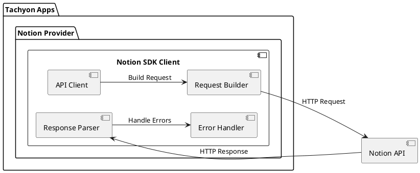

# Notion

## 実装タスク

### SDK実装
- 📝 Notion APIクライアントの実装
  - 📝 リクエストの構築
  - 📝 レスポンスの型定義
  - 📝 エラーハンドリング
  - 📝 レート制限への対応

### データベース操作API
- 📝 データベース一覧の取得
- 📝 データベースの作成
- 📝 データベースの更新
- 📝 データベースの削除
- 📝 データベースのクエリ実行
  - 📝 フィルター機能
  - 📝 ソート機能
  - 📝 ページネーション

### ページ操作API
- 📝 ページの作成
- 📝 ページの取得
- 📝 ページの更新
- 📝 ページの削除
- 📝 ページのプロパティ操作
  - 📝 テキスト
  - 📝 リッチテキスト
  - 📝 セレクト
  - 📝 マルチセレクト
  - 📝 日付
  - 📝 ユーザー
  - 📝 ファイル

### ブロック操作API
- 📝 ブロックの作成
- 📝 ブロックの取得
- 📝 ブロックの更新
- 📝 ブロックの削除
- 📝 ブロックの子要素操作
  - 📝 段落
  - 📝 見出し
  - 📝 リスト
  - 📝 テーブル
  - 📝 コードブロック
  - 📝 埋め込み要素

### 検索API
- 📝 ページの検索
- 📝 データベースの検索
- 📝 検索結果のフィルタリング

### テスト
- 📝 単体テストの実装
- 📝 統合テストの実装
- 📝 モックの実装

## システム構成図

## 内部アーキテクチャ

### API Client
- HTTPリクエストの実行
- レスポンスの受信
- 基本的な認証ヘッダーの管理

### Request Builder
- APIリクエストの構築
- クエリパラメータの構築
- リクエストボディの構築

### Response Parser
- レスポンスのパース
- 型安全な戻り値の生成
- エラーレスポンスの識別

### Error Handler
- エラーの種類の識別
- レート制限の処理
- 再試行ロジックの実装
